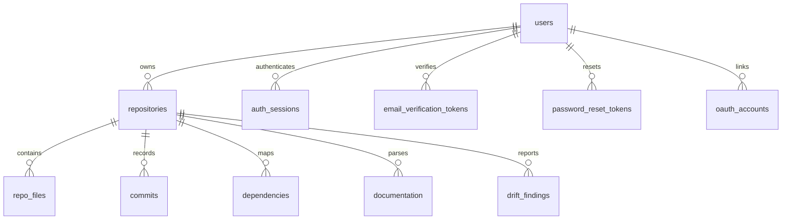

# CodePulse — Data Model Documentation

This document describes the current CodePulse MongoDB data model.

---

## Runtime Data Store

The backend connects to MongoDB through [backend/src/db/index.js](../../backend/src/db/index.js).
The connection string is read from `MONGO_URI`, with this local fallback:

```text
mongodb://127.0.0.1:27017/codepulse
```

If `MONGO_DB_NAME` is not set, the backend uses the database name from the
`MONGO_URI` path. For local Windows `npm` runs, a `MONGO_URI` host of `mongo`
is mapped to `127.0.0.1` because `mongo` is only resolvable inside a Docker
network. Set `MONGO_LOCAL_HOST` to override that local host mapping.

For local `mongodb+srv://` Atlas URIs, the backend sets Node's DNS servers to
`1.1.1.1,8.8.8.8` by default because some local DNS resolvers refuse SRV
lookups even when the operating system resolver succeeds. Set
`MONGO_DNS_SERVERS` to override the resolver list.

The MongoDB collection schema lives in:

* [backend/schema/db_schema.js](../../backend/schema/db_schema.js)
* [docs/database/MONGODB_SCHEMA.md](MONGODB_SCHEMA.md)

---

## Entity Relationship Overview



---

## Domain Entities

### `users`

Stores accounts authorized to access the CodePulse dashboard.

* `id` (`string`): UUID generated by the backend.
* `name` (`string`): User display name.
* `email` (`string`): Lowercased unique email address.
* `password_hash` (`string|null`): bcrypt password hash, or `null` for
  accounts created through GitHub/GitLab OAuth.
* `email_verified` (`boolean`): Whether the account has completed email
  verification.
* `profile` (`object`, optional): Account profile metadata used by the
  authenticated profile page.
  Fields: `title`, `company`, `timezone`, `location`, and `bio`.
* `settings` (`object`, optional): Account preferences used by the
  authenticated settings page.
  Fields: `theme`, `density`, `scan_frequency`, `ai_summary_level`,
  `email_notifications`, `weekly_digest`, `risk_alerts`, and `drift_alerts`.
* `created_at` (`string`): ISO timestamp for account creation.
* `updated_at` (`string`): ISO timestamp for the last account update.

### `auth_sessions`

Stores refresh-token sessions for signed-in users.

* `user_id`: Owner reference to `users`.
* `token_hash`: SHA-256 hash of the refresh token stored in the secure cookie.
* `user_agent`: Browser user agent captured at sign-in.
* `ip`: Request IP captured at sign-in.
* `created_at`: Session creation timestamp.
* `expires_at`: Session expiration timestamp.
* `revoked_at`: Session revocation timestamp when signed out or reset.

### `auth_attempts`

Stores Mongo-backed brute-force lockout counters.

* `key`: Composite email/IP lockout key.
* `email`: Normalized attempted email.
* `ip`: Request IP.
* `failures`: Failed sign-in count.
* `locked_until`: Timestamp until which sign-in is blocked.
* `created_at`: First failure timestamp.
* `updated_at`: Most recent failure timestamp.

### `email_verification_tokens`

Stores short-lived, hashed email verification tokens.

* `user_id`: Account being verified.
* `email`: Email address being verified.
* `token_hash`: SHA-256 hash of the verification token.
* `created_at`: Token creation timestamp.
* `expires_at`: Token expiration timestamp.

### `password_reset_tokens`

Stores short-lived, hashed password reset tokens.

* `user_id`: Account whose password can be reset.
* `email`: Account email.
* `token_hash`: SHA-256 hash of the reset token.
* `created_at`: Token creation timestamp.
* `expires_at`: Token expiration timestamp.
* `used_at`: Timestamp after the reset token has been consumed.

### `oauth_accounts`

Links a CodePulse user to an external OAuth identity (GitHub or GitLab).

* `provider`: `"github"` or `"gitlab"`.
* `provider_user_id`: The provider's stable user ID.
* `user_id`: Owner reference to `users`.
* `provider_email`: Email address reported by the provider at link time.
* `provider_name`: Display name reported by the provider at link time.
* `created_at`: Link creation timestamp.

### `repositories`

Stores high-level metadata for tracked repositories.

* `user_id`: Owner reference to `users`.
* `repo_name`: Repository name.
* `repo_url`: Git clone URL.
* `default_branch`: Primary scanned branch.
* `total_files`: Parsed file count.
* `total_commits`: Parsed commit count.
* `created_at`: Repository registration timestamp.

### `repo_files`

Stores files analyzed during repository intelligence.

* `repository_id`: Parent repository reference.
* `file_path`: Repository-relative path.
* `file_type`: Code, config, documentation, asset, etc.
* `language`: Detected programming language.
* `size`: File size in bytes.

### `commits`

Stores git commit metadata for churn and ownership analysis.

* `repository_id`: Parent repository reference.
* `commit_hash`: Git commit hash.
* `author`: Git author name or email.
* `message`: Commit message.
* `commit_date`: Commit timestamp.

### `dependencies`

Stores file-to-file dependency edges.

* `repository_id`: Parent repository reference.
* `source_file`: Importing file.
* `target_file`: Imported file.
* `dependency_type`: Import, require, package dependency, etc.

### `documentation`

Stores parsed documentation entries.

* `repository_id`: Parent repository reference.
* `doc_path`: Documentation file path.
* `content_summary`: Summary or semantic representation.

### `drift_findings`

Stores documentation drift findings.

* `repository_id`: Parent repository reference.
* `drift_type`: Drift classification.
* `description`: Human-readable finding summary.
* `severity`: `Low`, `Medium`, `High`, or `Critical`.
* `evidence`: Supporting snippets, metadata, or references.
