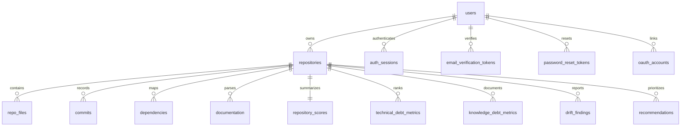

# CodePulse — Data Model Documentation

This document describes the current CodePulse MongoDB data model.

---

## Runtime Data Store

The backend connects to MongoDB through [backend/src/db/index.js](../../backend/src/db/index.js).
The connection string is read from `MONGO_URI`, with this local fallback:

```text
mongodb://127.0.0.1:27017/codepulse
```

If `MONGO_DB_NAME` is not set, the backend uses the database name from the
`MONGO_URI` path. For local Windows `npm` runs, a `MONGO_URI` host of `mongo`
is mapped to `127.0.0.1` because `mongo` is only resolvable inside a Docker
network. Set `MONGO_LOCAL_HOST` to override that local host mapping.

For local `mongodb+srv://` Atlas URIs, the backend sets Node's DNS servers to
`1.1.1.1,8.8.8.8` by default because some local DNS resolvers refuse SRV
lookups even when the operating system resolver succeeds. Set
`MONGO_DNS_SERVERS` to override the resolver list.

The MongoDB collection schema lives in:

* [backend/schema/db_schema.js](../../backend/schema/db_schema.js)
* [docs/database/MONGODB_SCHEMA.md](MONGODB_SCHEMA.md)

Repository Intelligence metadata is written by
[backend/src/features/repositories/services/repositoryStore.js](../../backend/src/features/repositories/services/repositoryStore.js).
Repeated scans of the same `user_id` and `repo_url` update the repository
record and replace the related file, documentation, commit, and dependency
records for that repository. Immediately afterward,
[analysisScorer.js](../../backend/src/features/analysis/services/analysisScorer.js)
replaces that repository's current score snapshot and module-level Technical
and Knowledge Debt metrics.

---

## Entity Relationship Overview



---

## Domain Entities

### `users`

Stores accounts authorized to access the CodePulse dashboard.

* `id` (`string`): UUID generated by the backend.
* `name` (`string`): User display name.
* `email` (`string`): Lowercased unique email address.
* `password_hash` (`string|null`): bcrypt password hash, or `null` for
  accounts created through GitHub/GitLab OAuth.
* `email_verified` (`boolean`): Whether the account has completed email
  verification.
* `profile` (`object`, optional): Account profile metadata used by the
  authenticated profile page.
  Fields: `title`, `company`, `timezone`, `location`, and `bio`.
* `settings` (`object`, optional): Account preferences used by the
  authenticated settings page.
  Fields: `theme`, `density`, `scan_frequency`, `ai_summary_level`,
  `email_notifications`, `weekly_digest`, `risk_alerts`, and `drift_alerts`.
* `created_at` (`string`): ISO timestamp for account creation.
* `updated_at` (`string`): ISO timestamp for the last account update.

### `auth_sessions`

Stores refresh-token sessions for signed-in users.

* `user_id`: Owner reference to `users`.
* `token_hash`: SHA-256 hash of the refresh token stored in the secure cookie.
* `user_agent`: Browser user agent captured at sign-in.
* `ip`: Request IP captured at sign-in.
* `created_at`: Session creation timestamp.
* `expires_at`: Session expiration timestamp.
* `revoked_at`: Session revocation timestamp when signed out or reset.

### `auth_attempts`

Stores Mongo-backed brute-force lockout counters.

* `key`: Composite email/IP lockout key.
* `email`: Normalized attempted email.
* `ip`: Request IP.
* `failures`: Failed sign-in count.
* `locked_until`: Timestamp until which sign-in is blocked.
* `created_at`: First failure timestamp.
* `updated_at`: Most recent failure timestamp.

### `email_verification_tokens`

Stores short-lived, hashed email verification tokens.

* `user_id`: Account being verified.
* `email`: Email address being verified.
* `token_hash`: SHA-256 hash of the verification token.
* `created_at`: Token creation timestamp.
* `expires_at`: Token expiration timestamp.

### `password_reset_tokens`

Stores short-lived, hashed password reset tokens.

* `user_id`: Account whose password can be reset.
* `email`: Account email.
* `token_hash`: SHA-256 hash of the reset token.
* `created_at`: Token creation timestamp.
* `expires_at`: Token expiration timestamp.
* `used_at`: Timestamp after the reset token has been consumed.

### `oauth_accounts`

Links a CodePulse user to an external OAuth identity (GitHub or GitLab).

* `provider`: `"github"` or `"gitlab"`.
* `provider_user_id`: The provider's stable user ID.
* `user_id`: Owner reference to `users`.
* `provider_email`: Email address reported by the provider at link time.
* `provider_name`: Display name reported by the provider at link time.
* `provider_access_token` (`string`, optional): AES-256-GCM encrypted OAuth
  token used only by the backend to list repositories for a connected source.
* `updated_at` (`date`, optional): Most recent OAuth connection refresh.
* `created_at`: Link creation timestamp.

### `repositories`

Stores high-level metadata for tracked repositories.

* `user_id`: Owner reference to `users`.
* `repo_name`: Repository name.
* `repo_full_name`: Owner/name identifier when available from GitHub.
* `repo_url`: Git clone URL.
* `clone_url`: Normalized Git clone URL used by the analyzer.
* `default_branch`: Primary scanned branch.
* `status`: Analysis lifecycle state — `queued`, `running`, `completed`, or
  `failed`. Set to `completed` once the current synchronous scan pipeline
  persists a repository.
* `total_files`: Parsed file count.
* `total_commits`: Parsed commit count.
* `total_dependencies`: Parsed dependency edge count.
* `total_documentation`: Parsed documentation file count.
* `created_at`: Repository registration timestamp.
* `updated_at`: Most recent scan timestamp.

### `repo_files`

Stores files analyzed during repository intelligence.

* `repository_id`: Parent repository reference.
* `file_path`: Repository-relative path.
* `file_name`: File basename.
* `extension`: Lowercased file extension.
* `file_type`: Code, config, documentation, asset, etc.
* `language`: Detected programming language.
* `size`: File size in bytes.
* `depth`: Repository-relative path depth.

### `commits`

Stores git commit metadata for churn and ownership analysis.

* `repository_id`: Parent repository reference.
* `commit_hash`: Git commit hash.
* `author`: Git author name or email.
* `author_email`: Git author email.
* `message`: Commit message.
* `commit_date`: Commit timestamp.
* `changed_files`: Repository-relative files changed by the commit.

### `dependencies`

Stores file-to-file dependency edges.

* `repository_id`: Parent repository reference.
* `source_file`: Importing file.
* `target_file`: Imported file.
* `dependency_type`: Import, require, package dependency, etc.
* `import_path`: Raw import specifier found in the source file.
* `resolved`: Whether the import was resolved to an internal repository file.

### `documentation`

Stores parsed documentation entries.

* `repository_id`: Parent repository reference.
* `doc_path`: Documentation file path.
* `file_name`: Documentation file basename.
* `documentation_type`: README, changelog, API doc, guide, license, etc.
* `content_summary`: Summary or semantic representation.
* `content`: Extracted documentation text, capped for large files.
* `size`: Source file size in bytes.
* `truncated`: Whether stored content was capped during extraction.

### `repository_scores`

Stores the latest generated score snapshot for one repository. It has a
unique `repository_id`, so a completed re-scan replaces rather than appends a
snapshot.

* `analysis_version`: Version of the scoring contract.
* `health_score`: Inverse weighted combination of Technical Debt, Knowledge
  Debt, and documentation drift (0 is poorest health; 100 is healthiest).
* `technical_debt`: Technical Debt score, grade, and aggregate metrics.
* `knowledge_debt`: Knowledge Debt score, coverage, onboarding difficulty,
  and aggregate metrics.
* `drift`: Current structural documentation-drift totals and coverage.
* `risk`: Current score-derived risk summary. Historical risk and health
  trends remain empty until a history feature is introduced.
* `recommendations_ready`: Count of persisted evidence-based recommendations.
* `analyzed_at`, `created_at`, `updated_at`: Score timing metadata.

### `technical_debt_metrics`

Stores the latest per-code-file Technical Debt evidence. The compound
`repository_id` + `file_path` index is unique; the score index supports debt
rankings.

* `complexity`: Transparent metadata heuristic using file size plus resolved
  internal dependency fan-in/fan-out, not AST cyclomatic complexity.
* `churn_percent`, `observed_churn_percent`, `churn_available`: Commit-based
  churn. Scores only use churn once at least five commits are available.
* `is_large_file`, `is_high_complexity`, `is_circular`, `is_orphan`,
  `is_stale`: Detection flags supporting the score.
* `debt_score`, `risk`, `reasons`: Module ranking and explainable evidence.
* `duplication_percent`: Currently `null`; a source-duplication detector has
  not been implemented.

### `knowledge_debt_metrics`

Stores current module documentation evidence. One record per repository
module identifies `documented` and, when absent, `missing_reason`.

### `drift_findings`

Stores documentation drift findings.

* `repository_id`: Parent repository reference.
* `finding_key`: Stable per-scan finding identifier; unique with the repository.
* `drift_type`: Drift classification.
* `title`, `description`: Human-readable finding summary.
* `file_path`, `module_path`: Affected documentation or code location when known.
* `severity`: `Low`, `Medium`, `High`, or `Critical`.
* `evidence`: Supporting snippets, metadata, or references.
* `age_days`: Documentation/code age gap when applicable.
* `created_at`, `updated_at`: Snapshot timestamps.

Structural findings currently cover undocumented modules, documentation that is
older than its associated source module, and backticked source paths in
documentation that no longer exist.

### `recommendations`

Stores the current ranked remediation suggestions. They are generated from
persisted debt, drift, and risk evidence without sending repository content to
an external model.

* `repository_id`: Parent repository reference.
* `recommendation_key`: Stable per-scan recommendation identifier; unique with
  the repository.
* `title`, `reason`, `steps`: Evidence-backed action and remediation steps.
* `impact`: `Low`, `Medium`, `High`, or `Critical`.
* `effort`: Human-readable estimated effort band.
* `order`: Current display priority.
* `created_at`, `updated_at`: Snapshot timestamps.
