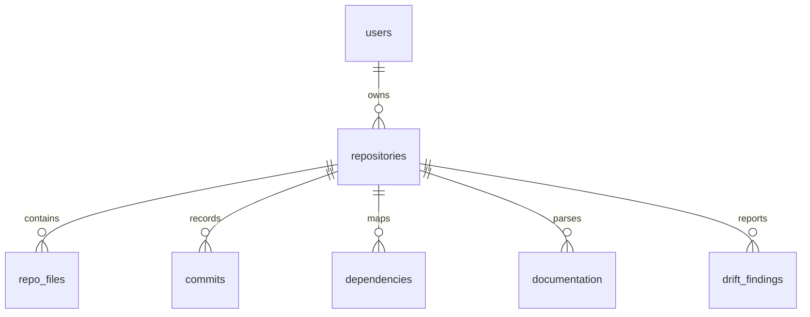

# CodePulse — Data Model Documentation

This document describes the current CodePulse data model and development data
store. SQL is not part of the active project setup.

---

## Runtime Data Store

The current backend stores development users in a local JSON file:

```text
backend/data/users.json
```

This file is created on first signup and is ignored by Git. The local JSON store
keeps the signup flow functional without requiring Docker, SQL, or an external
database process.

The draft long-term collection schema lives in:

* [backend/schema/db_schema.js](../../backend/schema/db_schema.js)
* [docs/database/MONGODB_SCHEMA.md](MONGODB_SCHEMA.md)

---

## Entity Relationship Overview



---

## Domain Entities

### `users`

Stores accounts authorized to access the CodePulse dashboard.

* `id` (`string`): UUID generated by the backend.
* `name` (`string`): User display name.
* `email` (`string`): Lowercased unique email address.
* `password_hash` (`string`): bcrypt password hash.
* `created_at` (`string`): ISO timestamp for account creation.

### `repositories`

Stores high-level metadata for tracked repositories.

* `user_id`: Owner reference to `users`.
* `repo_name`: Repository name.
* `repo_url`: Git clone URL.
* `default_branch`: Primary scanned branch.
* `total_files`: Parsed file count.
* `total_commits`: Parsed commit count.
* `created_at`: Repository registration timestamp.

### `repo_files`

Stores files analyzed during repository intelligence.

* `repository_id`: Parent repository reference.
* `file_path`: Repository-relative path.
* `file_type`: Code, config, documentation, asset, etc.
* `language`: Detected programming language.
* `size`: File size in bytes.

### `commits`

Stores git commit metadata for churn and ownership analysis.

* `repository_id`: Parent repository reference.
* `commit_hash`: Git commit hash.
* `author`: Git author name or email.
* `message`: Commit message.
* `commit_date`: Commit timestamp.

### `dependencies`

Stores file-to-file dependency edges.

* `repository_id`: Parent repository reference.
* `source_file`: Importing file.
* `target_file`: Imported file.
* `dependency_type`: Import, require, package dependency, etc.

### `documentation`

Stores parsed documentation entries.

* `repository_id`: Parent repository reference.
* `doc_path`: Documentation file path.
* `content_summary`: Summary or semantic representation.

### `drift_findings`

Stores documentation drift findings.

* `repository_id`: Parent repository reference.
* `drift_type`: Drift classification.
* `description`: Human-readable finding summary.
* `severity`: `Low`, `Medium`, `High`, or `Critical`.
* `evidence`: Supporting snippets, metadata, or references.
