# CodePulse — Database Schema Documentation

This document outlines the database schema, entity relationships, and table structures for the CodePulse platform.

---

## ⚙️ Database Engine & Configuration

* **Database Engine**: MySQL / MariaDB (configured via Docker Compose in [docker-compose.yaml](file:///home/arden/Coding/CodePulse/docker-compose.yaml))
* **Host Port**: `3306` (mapped to local host for client tools like MySQL Workbench)
* **Configuration Files**:
  * [databases/init/creation.sql](file:///home/arden/Coding/CodePulse/databases/init/creation.sql): Initial schema definition loaded on container startup.
  * `dockerFiles/dev/database/sql.Dockerfile`: Custom Docker container for database server.
  * [config/mysql-workbench](file:///home/arden/Coding/CodePulse/config/mysql-workbench): Shared volume folder for DB visual workbench configuration.

---

## 📊 Entity Relationship Diagram (ERD)

The diagram below outlines the references between tables stored in the database:

```mermaid
erDiagram
    users ||--o{ repositories : owns
    repositories ||--o{ repo_files : contains
    repositories ||--o{ commits : records
    repositories ||--o{ dependencies : maps
    repositories ||--o{ documentation : parses
    repositories ||--o{ drift_findings : reports
    
    users {
        int id PK
        varchar name
        varchar email UK
        text password_hash
        timestamp created_at
    }

    repositories {
        int id PK
        int user_id FK
        varchar repo_name
        text repo_url
        varchar default_branch
        int total_files
        int total_commits
        timestamp created_at
    }

    repo_files {
        int id PK
        int repository_id FK
        text file_path
        varchar file_type
        varchar language
        bigint size
    }

    commits {
        int id PK
        int repository_id FK
        varchar commit_hash
        varchar author
        text message
        timestamp commit_date
    }

    dependencies {
        int id PK
        int repository_id FK
        text source_file
        text target_file
        varchar dependency_type
    }

    documentation {
        int id PK
        int repository_id FK
        text doc_path
        text content_summary
    }

    drift_findings {
        int id PK
        int repository_id FK
        varchar drift_type
        text description
        varchar severity
        text evidence
    }
```

---

## 🗄️ Detailed Table Specifications

### 1. `users` Table
Stores user accounts authorized to access the CodePulse dashboard.

* `id` (SERIAL / Primary Key): Unique auto-incrementing user ID.
* `name` (VARCHAR(100)): User display name.
* `email` (VARCHAR(255) / UNIQUE / NOT NULL): User email address.
* `password_hash` (TEXT / NOT NULL): Secured password hash (e.g., bcrypt).
* `created_at` (TIMESTAMP): Account registration date.

### 2. `repositories` Table
Stores high-level metadata of tracked repositories.

* `id` (SERIAL / Primary Key): Unique repository identifier.
* `user_id` (INTEGER / Foreign Key -> `users.id`): References the owner of the repository project.
* `repo_name` (VARCHAR(255)): Name of the repository (e.g. `codepulse`).
* `repo_url` (TEXT): HTTPS or SSH GitHub repository clone URL.
* `default_branch` (VARCHAR(100)): The primary branch scanned (e.g. `main` or `master`).
* `total_files` (INTEGER): Count of files in the current checkout.
* `total_commits` (INTEGER): Count of commits extracted during cloning.
* `created_at` (TIMESTAMP): Date when the repository was added to the platform.

### 3. `repo_files` Table
Lists files analyzed in the repository structure (Vertical 1).

* `id` (SERIAL / Primary Key): Unique file record identifier.
* `repository_id` (INTEGER / Foreign Key -> `repositories.id`): Links to the repository parent.
* `file_path` (TEXT): Relative path of the file (e.g., `src/components/Hero.jsx`).
* `file_type` (VARCHAR(50)): Code, config, text, asset, etc.
* `language` (VARCHAR(50)): Programming language detected (e.g., `javascript`, `python`).
* `size` (BIGINT): File size in bytes.

### 4. `commits` Table
Chronicles development activity for technical debt/churn metrics (Vertical 3).

* `id` (SERIAL / Primary Key): Unique commit entry ID.
* `repository_id` (INTEGER / Foreign Key -> `repositories.id`): Repository reference.
* `commit_hash` (VARCHAR(64)): Unique SHA-1 git hash identifying the commit.
* `author` (VARCHAR(255)): Git author name/email.
* `message` (TEXT): Commit message content.
* `commit_date` (TIMESTAMP): Date and time of the git commit.

### 5. `dependencies` Table
Tracks dependency graphs for circular dependencies and coupling analyzes (Vertical 3).

* `id` (SERIAL / Primary Key): Unique dependency record ID.
* `repository_id` (INTEGER / Foreign Key -> `repositories.id`): Repository reference.
* `source_file` (TEXT): Relative path of importing file (e.g., `src/App.jsx`).
* `target_file` (TEXT): Relative path of imported file (e.g., `src/components/Hero.jsx`).
* `dependency_type` (VARCHAR(50)): Import, require, package dependency, etc.

### 6. `documentation` Table
Maintains catalog of documentation elements found in the repo (Vertical 2 & 4).

* `id` (SERIAL / Primary Key): Unique documentation record ID.
* `repository_id` (INTEGER / Foreign Key -> `repositories.id`): Repository reference.
* `doc_path` (TEXT): Location of markdown or text files (e.g. `README.md`, `docs/api.md`).
* `content_summary` (TEXT): Semantic representation or token summary of documentation sections.

### 7. `drift_findings` Table
Records structural mismatch findings identified by the Knowledge Drift Detection Engine (Vertical 2).

* `id` (SERIAL / Primary Key): Unique drift finding ID.
* `repository_id` (INTEGER / Foreign Key -> `repositories.id`): Repository reference.
* `drift_type` (VARCHAR(100)): Classification (e.g., `Missing documentation`, `Outdated documentation`, `Incorrect documentation`, `Dead documentation`).
* `description` (TEXT): Summary details detailing what code elements changed that are not updated in documentation.
* `severity` (VARCHAR(20)): Alert level (`low`, `medium`, `high`, `critical`).
* `evidence` (TEXT): Snippets or commit references showing discrepancy evidence.
