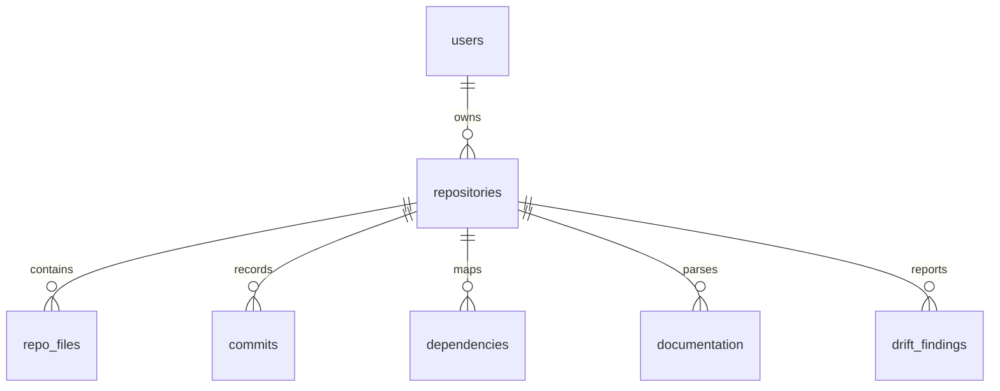

# CodePulse — MongoDB Schema Reference

This document converts the draft MongoDB setup in
[backend/schema/db_schema.js](../../backend/schema/db_schema.js) into a readable
collection reference. It is the canonical database-schema direction for future
persistent storage.

---

## Collections Overview

| Collection | Purpose | Key Indexes |
| :--- | :--- | :--- |
| `users` | Stores dashboard user accounts. | `email` unique |
| `repositories` | Stores repositories tracked by a user. | `user_id` |
| `repo_files` | Stores parsed files for a repository. | `repository_id` |
| `commits` | Stores git commit metadata. | `repository_id`, `commit_hash` unique, `commit_date` descending |
| `dependencies` | Stores file-to-file dependency edges. | `repository_id` |
| `documentation` | Stores parsed documentation entries. | `repository_id` |
| `drift_findings` | Stores documentation drift findings. | `repository_id` |

---

## Entity Relationships

References use `objectId` values in the draft MongoDB schema.

---

## Collection Details

### `users`

Required fields:

* `name` (`string`): User display name.
* `email` (`string`): User email address. Indexed as unique.
* `password_hash` (`string`): Hashed password.

Optional fields:

* `created_at` (`date`): Account creation timestamp.

Indexes:

* `{ email: 1 }`, unique.

### `repositories`

Required fields:

* `user_id` (`objectId`): Owner reference to `users`.
* `repo_name` (`string`): Repository name.
* `repo_url` (`string`): Git clone URL.

Optional fields:

* `default_branch` (`string`): Primary branch.
* `total_files` (`int`): Parsed file count.
* `total_commits` (`int`): Parsed commit count.
* `created_at` (`date`): Repository registration timestamp.

Indexes:

* `{ user_id: 1 }`.

### `repo_files`

Required fields:

* `repository_id` (`objectId`): Parent repository reference.
* `file_path` (`string`): Repository-relative file path.

Optional fields:

* `file_type` (`string`): Code, config, text, asset, etc.
* `language` (`string`): Detected programming language.
* `size` (`int`): File size.

Indexes:

* `{ repository_id: 1 }`.

### `commits`

Required fields:

* `repository_id` (`objectId`): Parent repository reference.
* `commit_hash` (`string`): Git commit hash.

Optional fields:

* `author` (`string`): Git author name or email.
* `message` (`string`): Commit message.
* `commit_date` (`date`): Commit timestamp.

Indexes:

* `{ repository_id: 1 }`.
* `{ commit_hash: 1 }`, unique.
* `{ commit_date: -1 }`.

### `dependencies`

Required fields:

* `repository_id` (`objectId`): Parent repository reference.
* `source_file` (`string`): Importing file.
* `target_file` (`string`): Imported file.

Optional fields:

* `dependency_type` (`string`): Import, require, package dependency, etc.

Indexes:

* `{ repository_id: 1 }`.

### `documentation`

Required fields:

* `repository_id` (`objectId`): Parent repository reference.
* `doc_path` (`string`): Documentation file path.

Optional fields:

* `content_summary` (`string`): Summary or semantic representation.

Indexes:

* `{ repository_id: 1 }`.

### `drift_findings`

Required fields:

* `repository_id` (`objectId`): Parent repository reference.
* `drift_type` (`string`): Drift classification.
* `severity` (`enum`): `Low`, `Medium`, `High`, or `Critical`.

Optional fields:

* `description` (`string`): Human-readable finding summary.
* `evidence` (`mixed`): Supporting snippets, metadata, or references.

Indexes:

* `{ repository_id: 1 }`.
