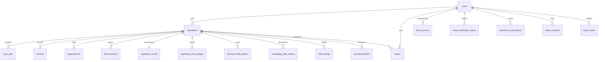

# CodePulse — MongoDB Schema Reference

This document converts the draft MongoDB setup in
[backend/schema/db_schema.js](../../backend/schema/db_schema.js) into a readable
collection reference. It is the canonical database-schema direction for future
persistent storage.

---

## Collections Overview

| Collection | Purpose | Key Indexes |
| :--- | :--- | :--- |
| `users` | Stores dashboard user accounts. | `email` unique |
| `auth_sessions` | Stores refresh-token sessions. | `token_hash` unique, `user_id`, `expires_at` TTL |
| `auth_attempts` | Stores sign-in brute-force counters. | `key` unique, `updated_at` TTL |
| `email_verification_tokens` | Stores hashed email verification tokens. | `token_hash` unique, `user_id`, `expires_at` TTL |
| `password_reset_tokens` | Stores hashed password reset tokens. | `token_hash` unique, `user_id`, `expires_at` TTL |
| `oauth_accounts` | Links a user to a GitHub/GitLab OAuth identity. | `provider`+`provider_user_id` unique, `user_id` |
| `oauth_states` | Stores one-time OAuth sign-in/connection handoffs. | `state_hash` unique, `expires_at` TTL |
| `repositories` | Stores repositories tracked by a user. | owner/update order, `user_id`+`repo_url` unique |
| `repo_files` | Stores parsed files for a repository. | repository/path order |
| `commits` | Stores git commit metadata. | `repository_id`+`commit_hash` unique, repository/date order |
| `dependencies` | Stores file-to-file dependency edges. | repository/source/target order |
| `documentation` | Stores parsed documentation entries. | repository/path order |
| `repository_scores` | Stores the latest debt, drift, health, and risk summary. | `repository_id` unique |
| `repository_score_history` | Stores compact score points for rescan trends. | `repository_id`+`analyzed_at` descending |
| `technical_debt_metrics` | Stores per-code-file Technical Debt evidence. | `repository_id`+`file_path` unique; score ranking |
| `knowledge_debt_metrics` | Stores per-module documentation evidence. | `repository_id`+`module_path` unique |
| `drift_findings` | Stores current structural and optional semantic documentation-drift findings. | `repository_id`+`finding_key` unique; severity |
| `recommendations` | Stores ranked, evidence-based remediation actions. | `repository_id`+`recommendation_key` unique; impact |
| `reports` | Stores immutable, shareable report snapshots. | owner/date, owner/repository/date, share token hash unique |

---

## Entity Relationships

References use `objectId` values in the draft MongoDB schema.

---

## Collection Details

### `users`

Required fields:

* `name` (`string`): User display name.
* `email` (`string`): User email address. Indexed as unique.
* `password_hash` (`string|null`): Hashed password, or `null` for OAuth-only
  accounts.
* `email_verified` (`bool`): Whether the user has completed email
  verification.

Optional fields:

* `profile` (`object`): Account profile metadata with optional `title`,
  `company`, `timezone`, `location`, and `bio` strings.
* `settings` (`object`): Account preferences with optional `theme`, `density`,
  `scan_frequency`, `ai_summary_level`, `email_notifications`,
  `weekly_digest`, `risk_alerts`, and `drift_alerts` fields.
* `created_at` (`date`): Account creation timestamp.
* `updated_at` (`date`): Last account update timestamp.

Indexes:

* `{ email: 1 }`, unique.

### `auth_sessions`

Required fields:

* `user_id` (`objectId`): Owner reference to `users`.
* `token_hash` (`string`): SHA-256 hash of the refresh token.
* `created_at` (`date`): Session creation timestamp.
* `expires_at` (`date`): Session expiration timestamp.

Optional fields:

* `user_agent` (`string`): Browser user agent.
* `ip` (`string`): Request IP captured at sign-in.
* `revoked_at` (`date|null`): Session revocation timestamp.

Indexes:

* `{ token_hash: 1 }`, unique.
* `{ user_id: 1 }`.
* `{ expires_at: 1 }`, TTL with `expireAfterSeconds: 0`.

### `auth_attempts`

Required fields:

* `key` (`string`): Composite email/IP lockout key.
* `email` (`string`): Normalized attempted email.
* `ip` (`string`): Request IP.
* `failures` (`int`): Failed sign-in count.
* `updated_at` (`date`): Last failure timestamp.

Optional fields:

* `locked_until` (`date`): Timestamp until which sign-in is blocked.
* `created_at` (`date`): First failure timestamp.

Indexes:

* `{ key: 1 }`, unique.
* `{ updated_at: 1 }`, TTL with `expireAfterSeconds: 3600`.

### `email_verification_tokens`

Required fields:

* `user_id` (`objectId`): User to verify.
* `email` (`string`): Email address being verified.
* `token_hash` (`string`): SHA-256 hash of the verification token.
* `created_at` (`date`): Token creation timestamp.
* `expires_at` (`date`): Token expiration timestamp.

Indexes:

* `{ token_hash: 1 }`, unique.
* `{ user_id: 1 }`.
* `{ expires_at: 1 }`, TTL with `expireAfterSeconds: 0`.

### `password_reset_tokens`

Required fields:

* `user_id` (`objectId`): User whose password can be reset.
* `email` (`string`): Account email.
* `token_hash` (`string`): SHA-256 hash of the reset token.
* `created_at` (`date`): Token creation timestamp.
* `expires_at` (`date`): Token expiration timestamp.

Optional fields:

* `used_at` (`date|null`): Timestamp after a reset token is consumed.

Indexes:

* `{ token_hash: 1 }`, unique.
* `{ user_id: 1 }`.
* `{ expires_at: 1 }`, TTL with `expireAfterSeconds: 0`.

### `oauth_accounts`

Required fields:

* `provider` (`enum`): `github` or `gitlab`.
* `provider_access_token` (`string`, optional): Encrypted provider token used
  by the server to read connected repository metadata.
* `provider_user_id` (`string`): The provider's stable user ID.
* `user_id` (`objectId`): Owner reference to `users`.
* `created_at` (`date`): Link creation timestamp.

Optional fields:

* `provider_email` (`string`): Email reported by the provider at link time.
* `provider_name` (`string`): Display name reported by the provider at link
  time.

Indexes:

* `{ provider: 1, provider_user_id: 1 }`, unique.
* `{ user_id: 1 }`.

### `oauth_states`

Required fields:

* `provider` (`enum`): `github` or `gitlab`.
* `intent` (`enum`): `signin` or `connect`.
* `state_hash` (`string`): SHA-256 hash of the provider state.
* `created_at`, `expires_at` (`date`): Lifetime of the one-time handoff.

Optional fields:

* `user_id` (`objectId|null`): CodePulse user that initiated an authenticated
  provider connection; `null` for ordinary OAuth sign-in.

Indexes:

* `{ state_hash: 1 }`, unique.
* `{ expires_at: 1 }`, TTL with `expireAfterSeconds: 0`.

### `repositories`

Required fields:

* `user_id` (`objectId`): Owner reference to `users`.
* `repo_name` (`string`): Repository name.
* `repo_url` (`string`): Git clone URL.

Optional fields:

* `repo_full_name` (`string`): Owner/name identifier when available from GitHub.
* `clone_url` (`string`): Normalized Git clone URL used by the analyzer.
* `default_branch` (`string`): Primary branch.
* `total_files` (`int`): Parsed file count.
* `total_commits` (`int`): Parsed commit count.
* `total_dependencies` (`int`): Parsed dependency edge count.
* `total_documentation` (`int`): Parsed documentation file count.
* `created_at` (`date`): Repository registration timestamp.
* `updated_at` (`date`): Most recent scan timestamp.

Indexes:

* `{ user_id: 1, updated_at: -1, _id: -1 }`.
* `{ user_id: 1, repo_url: 1 }`, unique.

### `repo_files`

Required fields:

* `repository_id` (`objectId`): Parent repository reference.
* `file_path` (`string`): Repository-relative file path.

Optional fields:

* `file_name` (`string`): File basename.
* `extension` (`string`): Lowercased file extension.
* `file_type` (`string`): Code, config, text, asset, etc.
* `language` (`string`): Detected programming language.
* `size` (`int`): File size.
* `depth` (`int`): Repository-relative path depth.

Indexes:

* `{ repository_id: 1, file_path: 1, _id: 1 }`.

### `commits`

Required fields:

* `repository_id` (`objectId`): Parent repository reference.
* `commit_hash` (`string`): Git commit hash.

Optional fields:

* `author` (`string`): Git author name or email.
* `author_email` (`string`): Git author email.
* `message` (`string`): Commit message.
* `commit_date` (`date`): Commit timestamp.
* `changed_files` (`array<string>`): Repository-relative files changed by the
  commit.

Indexes:

* `{ repository_id: 1, commit_hash: 1 }`, unique.
* `{ repository_id: 1, commit_date: -1, _id: -1 }`.

### `dependencies`

Required fields:

* `repository_id` (`objectId`): Parent repository reference.
* `source_file` (`string`): Importing file.
* `target_file` (`string`): Imported file.

Optional fields:

* `dependency_type` (`string`): Import, require, package dependency, etc.
* `import_path` (`string`): Raw import specifier found in the source file.
* `resolved` (`bool`): Whether the import was resolved to an internal
  repository file.

Indexes:

* `{ repository_id: 1, source_file: 1, target_file: 1, _id: 1 }`.

### `documentation`

Required fields:

* `repository_id` (`objectId`): Parent repository reference.
* `doc_path` (`string`): Documentation file path.

Optional fields:

* `file_name` (`string`): Documentation file basename.
* `documentation_type` (`string`): README, changelog, API doc, guide, license,
  etc.
* `content_summary` (`string`): Summary or semantic representation.
* `content` (`string`): Extracted documentation text, capped for large files.
* `size` (`int`): Source file size.
* `truncated` (`bool`): Whether stored content was capped during extraction.

Indexes:

* `{ repository_id: 1, doc_path: 1, _id: 1 }`.

### `repository_scores`

Required fields:

* `repository_id` (`objectId`): Parent repository reference.

Optional fields:

* `analysis_version` (`int`): Scoring-contract version.
* `health_score` (`number`): Current inverse debt health score.
* `health_trend` (`array<number>`): Legacy snapshot field; live trend payloads
  are assembled from `repository_score_history`.
* `technical_debt` (`object`): Score, grade, and aggregate Technical Debt
  metrics.
* `knowledge_debt` (`object`): Score, documentation coverage, onboarding
  difficulty, and aggregate Knowledge Debt metrics.
* `drift`, `risk` (`object`): Current structural drift and calculated-risk
  summaries.
* `recommendations_ready` (`int`): Number of persisted evidence-based
  remediation actions.
* `analyzed_at`, `created_at`, `updated_at` (`date`): Score timestamps.

Indexes:

* `{ repository_id: 1 }`, unique.

### `repository_score_history`

Required fields:

* `repository_id` (`objectId`): Parent repository reference.
* `health_score`, `risk_score` (`number`): Scan health and risk values.
* `analyzed_at` (`date`): Scan completion timestamp.

Optional fields:

* `technical_debt_score`, `knowledge_debt_score`, `drift_score` (`number`):
  Component score snapshots.
* `created_at` (`date`): Record creation timestamp.

Indexes:

* `{ repository_id: 1, analyzed_at: -1 }`.

### `technical_debt_metrics`

Required fields:

* `repository_id` (`objectId`): Parent repository reference.
* `file_path` (`string`): Repository-relative code-file path.

Optional fields:

* `owner` (`string`): Most frequent author in the captured change sample.
* `size`, `complexity`, `churn_percent`, `observed_churn_percent`,
  `debt_score` (`number`): File metrics and resulting debt score.
* `churn_available` (`bool`): Whether at least five commits were captured.
* `duplication_percent` (`number|null`): `null` until duplication analysis is
  implemented.
* `last_changed_at` (`date|null`): Latest captured change for the file.
* `is_large_file`, `is_high_complexity`, `is_circular`, `is_orphan`,
  `is_stale`, `dependency_graph_available` (`bool`): Detection evidence.
* `risk` (`string`): `Low`, `Medium`, `High`, or `Critical`.
* `reasons` (`array<string>`): Human-readable scoring evidence.
* `created_at`, `updated_at` (`date`): Snapshot timestamps.

Indexes:

* `{ repository_id: 1, file_path: 1 }`, unique.
* `{ repository_id: 1, debt_score: -1, file_path: 1 }`.

### `knowledge_debt_metrics`

Required fields:

* `repository_id` (`objectId`): Parent repository reference.
* `module_path` (`string`): Source-directory module path.

Optional fields:

* `documented` (`bool`): Whether the module matched documentation evidence.
* `missing_reason` (`string|null`): Explanation when the module is not
  documented.
* `api_routes`, `documented_api_routes`, `undocumented_api_routes` (`int`):
  Detected HTTP endpoint coverage for the module.
* `explainability_score` (`number`): Documentation/API/outline-based module
  explainability score.
* `complexity`, `complexity_penalty` (`number|null`): Metadata complexity
  context and its bounded explainability penalty.
* `created_at`, `updated_at` (`date`): Snapshot timestamps.

Indexes:

* `{ repository_id: 1, module_path: 1 }`, unique.

### `drift_findings`

Required fields:

* `repository_id` (`objectId`): Parent repository reference.
* `finding_key` (`string`): Stable finding identifier within the repository.
* `drift_type` (`string`): Drift classification.
* `severity` (`enum`): `Low`, `Medium`, `High`, or `Critical`.
* `semantic` (`object|null`): Optional model, similarity, threshold,
  confidence, and bounded compared excerpts for semantic-review findings.

Optional fields:

* `title`, `description` (`string`): Human-readable finding summary.
* `file_path`, `module_path` (`string|null`): Affected documentation or code
  location when known.
* `evidence` (`mixed`): Supporting snippets, metadata, or references.
* `age_days` (`number|null`): Documentation/code age difference when known.
* `review_status` (`confirmed|dismissed|null`), `reviewed_at` (`date|null`):
  Human review state for semantic findings; replaced by a re-scan.
* `created_at`, `updated_at` (`date`): Snapshot timestamps.

Indexes:

* `{ repository_id: 1, finding_key: 1 }`, unique.
* `{ repository_id: 1, severity: 1 }`.
* `{ repository_id: 1, drift_type: 1, review_status: 1 }`.

### `recommendations`

Required fields:

* `repository_id` (`objectId`): Parent repository reference.
* `recommendation_key` (`string`): Stable recommendation identifier within the
  repository.
* `title` (`string`): Remediation action title.
* `impact` (`enum`): `Low`, `Medium`, `High`, or `Critical`.

Optional fields:

* `effort`, `reason` (`string`): Effort band and evidence-based explanation.
* `steps` (`array<string>`): Ordered remediation steps.
* `order` (`int`): Current display priority.
* `created_at`, `updated_at` (`date`): Snapshot timestamps.

Indexes:

* `{ repository_id: 1, recommendation_key: 1 }`, unique.
* `{ repository_id: 1, impact: 1 }`.

### `reports`

Required fields:

* `owner_id` (`objectId`): User that generated and controls the report.
* `repository_id` (`objectId`): Source repository identity at generation time.
* `schema` (`string`), `schema_version` (`int`): Versioned snapshot contract.
* `snapshot` (`object`): Bounded immutable report content.
* `generated_at` (`date`): Report generation timestamp.

Optional fields:

* `source_analyzed_at` (`date|null`): Timestamp of the underlying scan.
* `share_token_hash` (`string`), `shared_at` (`date`): Revocable public-share
  state; raw share tokens are never stored.
* `created_at`, `updated_at` (`date`): Record timestamps.

Indexes:

* `{ owner_id: 1, created_at: -1, _id: -1 }`.
* `{ owner_id: 1, repository_id: 1, created_at: -1, _id: -1 }`.
* `{ share_token_hash: 1 }`, unique and partial for string values.
