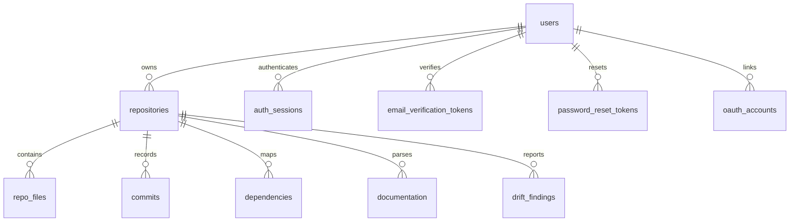

# CodePulse — MongoDB Schema Reference

This document converts the draft MongoDB setup in
[backend/schema/db_schema.js](../../backend/schema/db_schema.js) into a readable
collection reference. It is the canonical database-schema direction for future
persistent storage.

---

## Collections Overview

| Collection | Purpose | Key Indexes |
| :--- | :--- | :--- |
| `users` | Stores dashboard user accounts. | `email` unique |
| `auth_sessions` | Stores refresh-token sessions. | `token_hash` unique, `user_id`, `expires_at` TTL |
| `auth_attempts` | Stores sign-in brute-force counters. | `key` unique, `updated_at` TTL |
| `email_verification_tokens` | Stores hashed email verification tokens. | `token_hash` unique, `user_id`, `expires_at` TTL |
| `password_reset_tokens` | Stores hashed password reset tokens. | `token_hash` unique, `user_id`, `expires_at` TTL |
| `oauth_accounts` | Links a user to a GitHub/GitLab OAuth identity. | `provider`+`provider_user_id` unique, `user_id` |
| `repositories` | Stores repositories tracked by a user. | `user_id`, `user_id`+`repo_url` unique |
| `repo_files` | Stores parsed files for a repository. | `repository_id` |
| `commits` | Stores git commit metadata. | `repository_id`, `commit_hash` unique, `commit_date` descending |
| `dependencies` | Stores file-to-file dependency edges. | `repository_id` |
| `documentation` | Stores parsed documentation entries. | `repository_id` |
| `drift_findings` | Stores documentation drift findings. | `repository_id` |

---

## Entity Relationships

References use `objectId` values in the draft MongoDB schema.

---

## Collection Details

### `users`

Required fields:

* `name` (`string`): User display name.
* `email` (`string`): User email address. Indexed as unique.
* `password_hash` (`string|null`): Hashed password, or `null` for OAuth-only
  accounts.
* `email_verified` (`bool`): Whether the user has completed email
  verification.

Optional fields:

* `profile` (`object`): Account profile metadata with optional `title`,
  `company`, `timezone`, `location`, and `bio` strings.
* `settings` (`object`): Account preferences with optional `theme`, `density`,
  `scan_frequency`, `ai_summary_level`, `email_notifications`,
  `weekly_digest`, `risk_alerts`, and `drift_alerts` fields.
* `created_at` (`date`): Account creation timestamp.
* `updated_at` (`date`): Last account update timestamp.

Indexes:

* `{ email: 1 }`, unique.

### `auth_sessions`

Required fields:

* `user_id` (`objectId`): Owner reference to `users`.
* `token_hash` (`string`): SHA-256 hash of the refresh token.
* `created_at` (`date`): Session creation timestamp.
* `expires_at` (`date`): Session expiration timestamp.

Optional fields:

* `user_agent` (`string`): Browser user agent.
* `ip` (`string`): Request IP captured at sign-in.
* `revoked_at` (`date|null`): Session revocation timestamp.

Indexes:

* `{ token_hash: 1 }`, unique.
* `{ user_id: 1 }`.
* `{ expires_at: 1 }`, TTL with `expireAfterSeconds: 0`.

### `auth_attempts`

Required fields:

* `key` (`string`): Composite email/IP lockout key.
* `email` (`string`): Normalized attempted email.
* `ip` (`string`): Request IP.
* `failures` (`int`): Failed sign-in count.
* `updated_at` (`date`): Last failure timestamp.

Optional fields:

* `locked_until` (`date`): Timestamp until which sign-in is blocked.
* `created_at` (`date`): First failure timestamp.

Indexes:

* `{ key: 1 }`, unique.
* `{ updated_at: 1 }`, TTL with `expireAfterSeconds: 3600`.

### `email_verification_tokens`

Required fields:

* `user_id` (`objectId`): User to verify.
* `email` (`string`): Email address being verified.
* `token_hash` (`string`): SHA-256 hash of the verification token.
* `created_at` (`date`): Token creation timestamp.
* `expires_at` (`date`): Token expiration timestamp.

Indexes:

* `{ token_hash: 1 }`, unique.
* `{ user_id: 1 }`.
* `{ expires_at: 1 }`, TTL with `expireAfterSeconds: 0`.

### `password_reset_tokens`

Required fields:

* `user_id` (`objectId`): User whose password can be reset.
* `email` (`string`): Account email.
* `token_hash` (`string`): SHA-256 hash of the reset token.
* `created_at` (`date`): Token creation timestamp.
* `expires_at` (`date`): Token expiration timestamp.

Optional fields:

* `used_at` (`date|null`): Timestamp after a reset token is consumed.

Indexes:

* `{ token_hash: 1 }`, unique.
* `{ user_id: 1 }`.
* `{ expires_at: 1 }`, TTL with `expireAfterSeconds: 0`.

### `oauth_accounts`

Required fields:

* `provider` (`enum`): `github` or `gitlab`.
* `provider_user_id` (`string`): The provider's stable user ID.
* `user_id` (`objectId`): Owner reference to `users`.
* `created_at` (`date`): Link creation timestamp.

Optional fields:

* `provider_email` (`string`): Email reported by the provider at link time.
* `provider_name` (`string`): Display name reported by the provider at link
  time.

Indexes:

* `{ provider: 1, provider_user_id: 1 }`, unique.
* `{ user_id: 1 }`.

### `repositories`

Required fields:

* `user_id` (`objectId`): Owner reference to `users`.
* `repo_name` (`string`): Repository name.
* `repo_url` (`string`): Git clone URL.

Optional fields:

* `repo_full_name` (`string`): Owner/name identifier when available from GitHub.
* `clone_url` (`string`): Normalized Git clone URL used by the analyzer.
* `default_branch` (`string`): Primary branch.
* `total_files` (`int`): Parsed file count.
* `total_commits` (`int`): Parsed commit count.
* `total_dependencies` (`int`): Parsed dependency edge count.
* `total_documentation` (`int`): Parsed documentation file count.
* `created_at` (`date`): Repository registration timestamp.
* `updated_at` (`date`): Most recent scan timestamp.

Indexes:

* `{ user_id: 1 }`.
* `{ user_id: 1, repo_url: 1 }`, unique.

### `repo_files`

Required fields:

* `repository_id` (`objectId`): Parent repository reference.
* `file_path` (`string`): Repository-relative file path.

Optional fields:

* `file_name` (`string`): File basename.
* `extension` (`string`): Lowercased file extension.
* `file_type` (`string`): Code, config, text, asset, etc.
* `language` (`string`): Detected programming language.
* `size` (`int`): File size.
* `depth` (`int`): Repository-relative path depth.

Indexes:

* `{ repository_id: 1 }`.

### `commits`

Required fields:

* `repository_id` (`objectId`): Parent repository reference.
* `commit_hash` (`string`): Git commit hash.

Optional fields:

* `author` (`string`): Git author name or email.
* `author_email` (`string`): Git author email.
* `message` (`string`): Commit message.
* `commit_date` (`date`): Commit timestamp.
* `changed_files` (`array<string>`): Repository-relative files changed by the
  commit.

Indexes:

* `{ repository_id: 1 }`.
* `{ commit_hash: 1 }`, unique.
* `{ commit_date: -1 }`.

### `dependencies`

Required fields:

* `repository_id` (`objectId`): Parent repository reference.
* `source_file` (`string`): Importing file.
* `target_file` (`string`): Imported file.

Optional fields:

* `dependency_type` (`string`): Import, require, package dependency, etc.
* `import_path` (`string`): Raw import specifier found in the source file.
* `resolved` (`bool`): Whether the import was resolved to an internal
  repository file.

Indexes:

* `{ repository_id: 1 }`.

### `documentation`

Required fields:

* `repository_id` (`objectId`): Parent repository reference.
* `doc_path` (`string`): Documentation file path.

Optional fields:

* `file_name` (`string`): Documentation file basename.
* `documentation_type` (`string`): README, changelog, API doc, guide, license,
  etc.
* `content_summary` (`string`): Summary or semantic representation.
* `content` (`string`): Extracted documentation text, capped for large files.
* `size` (`int`): Source file size.
* `truncated` (`bool`): Whether stored content was capped during extraction.

Indexes:

* `{ repository_id: 1 }`.

### `drift_findings`

Required fields:

* `repository_id` (`objectId`): Parent repository reference.
* `drift_type` (`string`): Drift classification.
* `severity` (`enum`): `Low`, `Medium`, `High`, or `Critical`.

Optional fields:

* `description` (`string`): Human-readable finding summary.
* `evidence` (`mixed`): Supporting snippets, metadata, or references.

Indexes:

* `{ repository_id: 1 }`.
