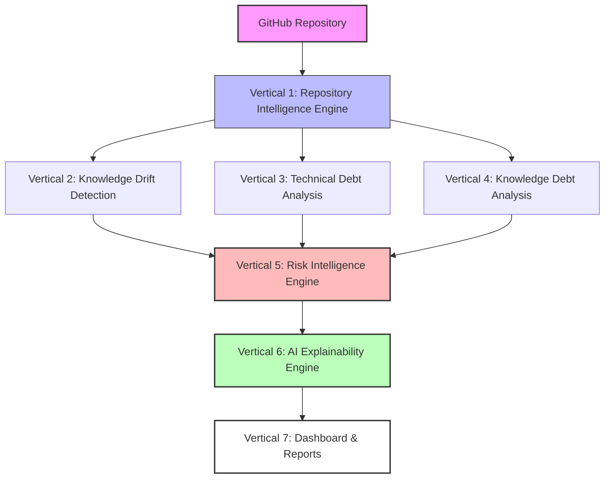

# CodePulse — Project Workflow & Architecture

This document details the end-to-end workflow, architecture layout, and core verticals of the **CodePulse** Engineering Intelligence Platform. 

---

## 🌟 30-Second Project Pitch
**CodePulse** is an AI-assisted Engineering Intelligence Platform that analyzes software repositories beyond traditional static analysis. It extracts repository structure, detects knowledge drift between code and documentation, quantifies technical and knowledge debt, evaluates maintainability risks, and provides AI-generated explanations with actionable recommendations. The platform enables engineering teams to proactively improve repository health, reduce maintenance costs, and sustain long-term software quality.

---

## 🔄 End-to-End Processing Workflow
Below is the processing pipeline that runs when a user submits a GitHub repository for evaluation:



---

## 🏢 Overall Architecture Map

The system is split into three main tiers: data aggregation, analytical engines, and presentation layers.

```text
                    GitHub Repository
                           │
                           ▼
               Repository Intelligence Engine (Vertical 1)
                           │
      ┌────────────────────┼────────────────────┐
      ▼                    ▼                    ▼
Knowledge Drift (V2)  Technical Debt (V3)  Repository Metrics (V4)
      │                    │                    │
      └──────────────┬─────┴────────────────────┘
                     ▼
          Knowledge Debt Assessment (V4)
                     │
                     ▼
          Repository Risk Intelligence (V5)
                     │
                     ▼
       AI Explainability & Recommendations (V6)
                     │
                     ▼
         Dashboard / Reports / Analytics (V7)
```

---

## 📊 The 7 Core Project Verticals

### Vertical 1 — Repository Intelligence Engine

* **Objective**: Collect, clone, parse, and structure repository metadata and files.
* **Input**: GitHub Repository URL.
* **Functions**:
  * Clone the target repository.
  * Parse source code structures (classes, methods, dependency maps).
  * Parse markdown files (README, directories, wikis).
  * Extract git commit histories (authors, dates, commit frequencies, modifications).
  * Generate dependency graphs showing module connections.
  * Identify distinct modules, services, and libraries.
* **Output**: A structured JSON representation of the repository (stored in DB tables: `repositories`, `repo_files`, `commits`, `dependencies`, `documentation`).

### Vertical 2 — Knowledge Drift Detection

* **Objective**: Detect inconsistencies where code implementation and documentation have diverged.
* **Process**:
  * Compare semantic content of directories and source files with associated documentation.
  * Scan for changes in function signatures or APIs not updated in markdown files.
  * Identify documentation references pointing to deleted modules/files.
* **Drift Classifications**:
  * **Missing Documentation**: A module lacks any README or descriptive files.
  * **Outdated Documentation**: The code has changed recently, but documentation was updated months ago.
  * **Incorrect Documentation**: Documentation describes features or variables that do not match the codebase.
  * **Dead Documentation**: Document exists for a module that has been deleted or fully refactored.
* **Output**: Knowledge Drift Report (stored in `drift_findings`).

### Vertical 3 — Technical Debt Analysis

* **Objective**: Measure code quality, code maintainability, and structural integrity.
* **Metrics Tracked**:
  * **Cyclomatic Complexity**: Measures the number of linear paths through code.
  * **Code Duplication**: Percentages of duplicated code blocks.
  * **Circular Dependencies**: Import loops between files or packages.
  * **Large Classes / Long Methods**: Complexity and readability risks.
  * **High Code Churn**: Files modified frequently indicating instability.
  * **Frequent Bug Fixes**: Files appearing often in bug-fix commit patterns.
* **Output**: Technical Debt Score, Repository Health Metrics, and Maintainability Index.

### Vertical 4 — Knowledge Debt Analysis

* **Objective**: Evaluate the documentation quality and knowledge sustainability of the project.
* **Evaluated Factors**:
  * **Documentation Coverage**: Ratio of code files/functions documented to total files/functions.
  * **Architecture Documentation**: Presence of high-level workflow diagrams or architecture text.
  * **API Documentation**: Coverage of API endpoints, inputs, outputs, and parameters.
  * **Module Explainability**: Ease of parsing codebase files for onboarding.
  * **Onboarding Complexity**: Overall score summarizing documentation accessibility for new hires.
* **Output**: Knowledge Debt Score and Documentation Coverage reports.

### Vertical 5 — Risk Intelligence Engine

* **Objective**: Prioritize engineering risks to give actionable guidance.
* **Algorithm**:
  * Combines inputs from Technical Debt (Complexity, Churn, Duplication), Knowledge Debt (Missing or outdated documentation), and Repository Activity (Commit density, key author dependencies).
  * Categorizes modules into risk levels (Low, Medium, High, Critical).
* **Example Calculation**:
  ```text
  Billing Module:
  ├── Technical Debt  : High (Cyclomatic Complexity > 50, Circular Dependency)
  ├── Knowledge Debt  : Medium (README exists but is 6 months outdated)
  └── Repo Activity   : High (Modified in 80% of recent commits)
  └── OVERALL RISK    : CRITICAL (Needs immediate refactoring and documentation updates)
  ```
* **Output**: Risk scores, Risk categories, and Refactoring Priorities.

### Vertical 6 — AI Explainability Engine

* **Objective**: Provide human-readable, context-aware explanations and refactoring steps.
* **Responsibilities**:
  * Explain **why** a module is considered risky using evidence.
  * Summarize repository health highlights.
  * Recommend concrete, actionable remediation steps.
* **Example AI Output**:
  ```text
  Module: Billing Service (Risk Score: 87/100)
  
  Reasons Identified:
  • Documentation Drift: README references payment gateways removed in commit #8af291.
  • Technical Debt: Circular dependency detected between BillingService and InvoiceGenerator.
  • Maintenance Risk: 92% of changes made by a single author (key-person risk).
  
  Recommendations:
  1. Decouple InvoiceGenerator from BillingService by introducing an Event Broker or Interface.
  2. Run the update documentation pipeline on the Billing README.
  3. Reassign billing bugs to other team members to distribute knowledge.
  ```

### Vertical 7 — Dashboard

* **Objective**: Provide a premium visual interface representing repository health.
* **Sub-dashboards**:
  * **Repository Overview**: High-level health index, overall technical debt, knowledge debt, and critical risks.
  * **Technical Debt View**: Visual heatmaps mapping complexity and churn, modular ranking tables, and historical trends.
  * **Knowledge Debt View**: Documentation coverage metrics, outdated file lists, and drift visualizer.
  * **Actionable Recommendations**: Cards displaying AI explanations, refactoring steps, and copyable commands.
